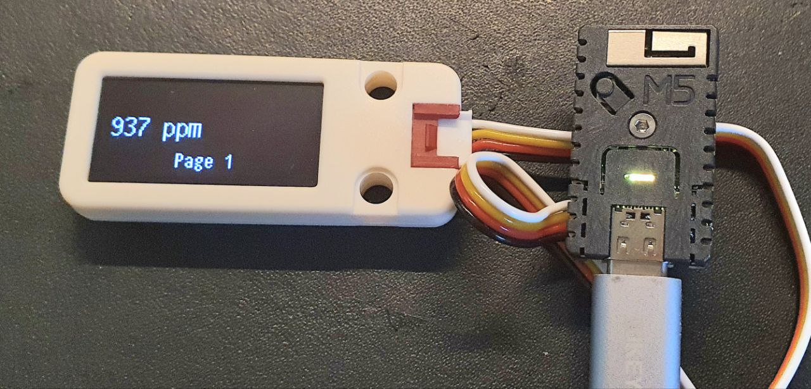
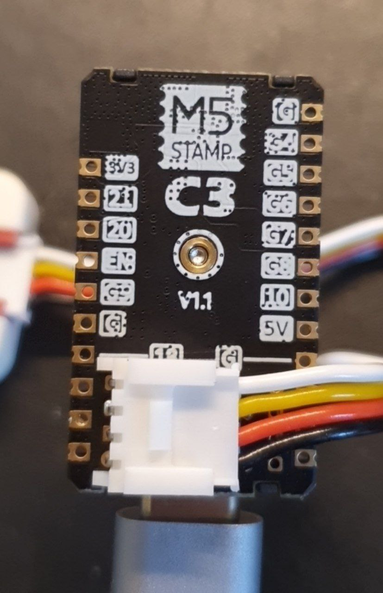

# Screeny
ESPHome configuration the M5Stamp (ESP32-C3) combined with a M5 OLED screen. 

 

Features:
- LED indicates booting status: red for booting, yellow for connecting to WiFi, green for connected
- After booting, the LED gives a visual indication of CO2 levels from green @500ppm to red @1800ppm, same as [RomainGehrig/ESPHome-CO2Sensor](https://github.com/RomainGehrig/ESPHome-CO2Sensor)
- Display has two basic pages: CO2 ppm (p1), Home Assistant connection status (p2)
- Click on the button to change pages
- Integration with Home Assistant

Hardware:
- ESP32 board: M5Stamp C3 (https://shop.m5stack.com/collections/m5-controllers/products/m5stamp-c3-mate-with-pin-headers)
- OLED display: M5 OLED unit 1.3", 128x64px, i2c (https://shop.m5stack.com/products/oled-unit-1-3-128-64-display)
- Connected using PORT.U on M5Stamp (SCL on GPIO18, SDA on GPIO19)

 

